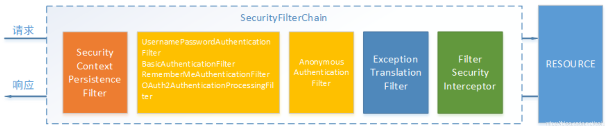

---
# spring security demo 解析
#### author：闽东打桩机:chicken:
**spring security 核心内容主要分为两点：用户认证，权限效验。 原理主要是由过滤器（FilterChainProxy中SecurityFilterChain）内置的多个有序的过滤器对请求进行过滤，过滤成功后才能访问REST接口。想要使用该框架主要操作就是对过滤链进行配置，及自定义过滤链。下文为jwt+security流程。**
* ***认证：应用于对用户登录进行一系列的效验。***
* ***授权：应用于用户登录成功后对用户资源访问权限的控制。***



## 创建表
1、角色表
```
DROP TABLE IF EXISTS `role`;
CREATE TABLE `role`  (
  `id` bigint(0) NOT NULL,
  `name` varchar(255) CHARACTER SET utf8 COLLATE utf8_general_ci NOT NULL,
  PRIMARY KEY (`id`) USING BTREE
) ENGINE = InnoDB CHARACTER SET = utf8 COLLATE = utf8_general_ci ROW_FORMAT = Dynamic;

INSERT INTO `role` VALUES (1, 'ROLE_ADMIN');
INSERT INTO `role` VALUES (2, 'ROLE_NOMAL');
SET FOREIGN_KEY_CHECKS = 1;
```
2、用户表
```
DROP TABLE IF EXISTS `user`;
CREATE TABLE `user`  (
  `id` bigint(0) NOT NULL,
  `username` varchar(255) CHARACTER SET utf8 COLLATE utf8_general_ci NOT NULL,
  `password` varchar(255) CHARACTER SET utf8 COLLATE utf8_general_ci NOT NULL,
  PRIMARY KEY (`id`) USING BTREE
) ENGINE = InnoDB CHARACTER SET = utf8 COLLATE = utf8_general_ci ROW_FORMAT = Dynamic;

INSERT INTO `user` VALUES (1, 'user', '123');
INSERT INTO `user` VALUES (2, 'admin', '123');

SET FOREIGN_KEY_CHECKS = 1;
```
3、用户角色表
```
DROP TABLE IF EXISTS `role_user`;
CREATE TABLE `role_user`  (
  `role_id` bigint(0) NOT NULL,
  `user_id` bigint(0) NOT NULL
) ENGINE = InnoDB CHARACTER SET = utf8 COLLATE = utf8_general_ci ROW_FORMAT = Dynamic;

INSERT INTO `role_user` VALUES (1, 2);
INSERT INTO `role_user` VALUES (2, 1);

SET FOREIGN_KEY_CHECKS = 1;
```

## 1、pom文件引入
```java
        <!-- spring security -->
        <dependency>
            <groupId>org.springframework.boot</groupId>
            <artifactId>spring-boot-starter-security</artifactId>
        </dependency>
        <!-- jwt -->
        <dependency>
            <groupId>io.jsonwebtoken</groupId>
            <artifactId>jjwt</artifactId>
            <version>0.9.1</version>
        </dependency>
```

## 2、Security配置中心
**新建配置中心类继承WebSecurityConfigurerAdapter。添加以下注解。**
```java
@Configuration
@EnableWebSecurity
//开启注解权限（如@PreAuthorize("hasRole('ROLE_NOMAL')")）
@EnableGlobalMethodSecurity(prePostEnabled = true,securedEnabled = true)
```
**该类主要重写父类的三种方法如下：**

**一、该方法主要作用是配置项目的访问权限以及添加自定义过滤器，和一些保护配置。其中末尾的addFilterBefore是使用自定义过滤器替代默认过滤器。这些配置方法和html中的标签相似，如果方法没有闭合则方法不生效。我在写不需要拦截页面时（perimitAll方法）时发现配置并不生效最后查了半天资料才发现是格式原因。以下是一些主要的方法解释：**
```java
    @Override
    protected void configure(HttpSecurity http) throws Exception {
                http.authorizeRequests()
                //绑定user角色账户可访问/hello接口
                .antMatchers("/hello").hasRole("NOMAL")
                //admin角色可访问/admin接口,也可在Rest接口使用@Perauthorize
                .antMatchers("/admin").hasRole("ADMIN")
                .antMatchers("/index").permitAll()
                //POST方法/login登录请求无需验证
                .antMatchers(HttpMethod.POST,"/login").permitAll()
                .and()
                //登录页面路由配置
                .formLogin().loginPage("/login").permitAll()
                .and()
                .authorizeRequests()    //其余请求均需要认证
                .anyRequest().authenticated()
                .and()
                //登出页面配置及登出重定向页面
                .logout().logoutUrl("/logout").logoutSuccessUrl("/login")
                //.logoutSuccessHandler()退出登录自定义配置
                .and()
                //添加自定义过滤器
                .addFilterBefore(new JwtLoginFilter("/login",authenticationManager()), UsernamePasswordAuthenticationFilter.class)
                .addFilterBefore(new JwtTokenFilter(),UsernamePasswordAuthenticationFilter.class)
                //csrf 禁止使用
                .csrf().disable();
    }
```
* **`anyRequest  |  匹配所有请求路径`**
* **`anonymous | 匿名可以访问`**
* **`fullyAuthenticated | 用户完全认证可以访问（非remember-me下自动登录）`**

* **`hasRole | 如果有参数，参数表示角色，则其角色可以访问`**
* **`hasIpAddress | 如果有参数，参数表示IP地址，如果用户IP和参数匹配，则可以访问`**
* **`authenticated       |   用户登录后可访问`**
* **`rememberMe          |   允许通过remember-me登录的用户访问`**
* **`permitAll           |   用户可以任意访问`**
* **`hasAuthority        |   如果有参数，参数表示权限，则其权限可以访问`**
* **`hasAnyRole          |   如果有参数，参数表示角色，则其中任何一个角色可以访问`**
* **`hasAnyAuthority     |   如果有参数，参数表示权限，则其中任何一个权限可以访问`**


**二、重写该方法，配置中心将会采用自定义的登录过滤器**
```java
    @Override
    protected void configure(AuthenticationManagerBuilder auth) throws Exception {
        //自定义账户验证
        auth.authenticationProvider(authProvider);
        //写入内存
/*        auth.inMemoryAuthentication().withUser("admin")
                .password("123").roles("admin")
                .and()
                .withUser("sang")
                .password("456")
                .roles("user");*/
    }
```

**三、该方法可以同一配置不需要拦截的路由**
```java
    @Override
    public void configure(WebSecurity web) {
        //解决静态资源被拦截的问题
        web.ignoring().antMatchers("/index");
    }
```

启动项目后项目可能会报错，原因是找不到AuthenticationManager这个类，重写以下代码。
```java
    @Bean
    @Override
    public AuthenticationManager authenticationManagerBean() throws Exception
    {
        return super.authenticationManagerBean();
    }
```
